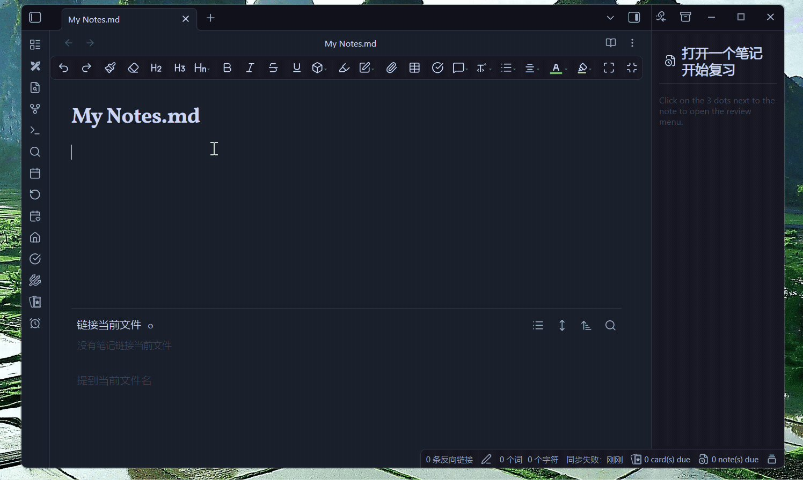

# Bring to Front

[](https://github.com/rockbenben/bring-obsidian-to-front/releases/latest)
[](LICENSE)

English | [中文](README_zh.md)

## Description

When Obsidian is in the background and a modal or notice appears, this plugin automatically brings the window to the foreground. **Zero configuration needed** — install, enable, and it just works. Optionally filter by keywords and watch scope to trigger only on specific content.

> **Desktop only** (Windows / macOS / Linux). Requires Electron APIs for window management.



## Key Features

- **Auto bring-to-front:** When Obsidian is in the background, automatically brings the window to front on new modals or notices
- **Keyword filtering:** Optional comma-separated keywords to trigger only on specific content
- **Flexible watch scope:** Monitor modals, notices, both, or custom CSS selectors
- **Cooldown protection:** Configurable minimum focus interval to avoid focus thrashing
- **Bilingual UI:** Full English/Chinese support with auto detection

## Installation

### Method 1: Manual Installation

1. Download the latest release from [GitHub Releases](https://github.com/rockbenben/bring-obsidian-to-front/releases)
2. Extract the downloaded files
3. Copy the plugin folder to your vault's plugins directory:

   ```text
   YourVault/.obsidian/plugins/bring-to-front/
   ```

4. Restart Obsidian or reload plugins
5. Enable the plugin in Settings -> Community Plugins

### Method 2: Using BRAT (Beta Reviewers Auto-update Tool)

1. Install the [BRAT plugin](https://github.com/TfTHacker/obsidian42-brat)
2. Open BRAT settings and click Add Beta Plugin
3. Enter the repository: rockbenben/bring-obsidian-to-front
4. Click Add Plugin and enable it

## Configuration

Open Settings -> Community Plugins -> Bring to Front.

### Settings

| Setting            | Description                                                        | Default         | Range              |
| ------------------ | ------------------------------------------------------------------ | --------------- | ------------------ |
| Language           | Interface language                                                 | Auto-detect     | Auto / English / 中文 |
| Keywords           | Comma-separated keywords to filter triggers, case-insensitive (empty = match all) | Empty           | Any text           |
| Watch scope        | Which DOM elements to monitor                                      | Modals & Notices| Modals / Notices / Both / Custom |
| Custom CSS selector| Custom selector (only when scope = Custom)                         | Empty           | Valid CSS selector |
| Focus cooldown     | Minimum seconds between focus actions (0 = no cooldown)            | 5 seconds       | >= 0               |
| Debug mode         | Log matching details to console                                    | Disabled        | On / Off           |

### Usage Examples

| Use Case            | Keywords        | Watch Scope |
| ------------------- | --------------- | ----------- |
| Any modal/notice    | (leave empty)   | Both        |
| Reminder popup      | `Snooze, Done`  | Modals      |
| Error alerts        | `error, failed` | Notices     |
| Specific plugin     | (leave empty)   | Custom: `[data-type="my-plugin"]` |

### Tips

- Shorter focus cooldown (1-30 s) = for frequent triggers
- Longer focus cooldown (>= 120 s) = less intrusive

## How It Works

1. **MutationObserver:** Watches the DOM in real time for new elements matching the configured scope
2. **Keyword matching:** If keywords are configured, the element's text content is checked against them
3. **Cooldown check:** Ensures minimum interval between consecutive focus actions
4. **Bring to front:** Raises the Obsidian window via Electron APIs (restore, show, alwaysOnTop trick, focus)

## Troubleshooting

| Issue                | Possible Cause               | Solution                          |
| -------------------- | ---------------------------- | --------------------------------- |
| Too frequent focusing| Focus cooldown too short     | Increase focus cooldown           |
| Not detecting        | Wrong scope or keywords      | Check settings; try empty keywords with "Both" scope |
| Language not switching| Cache/reload issue           | Restart Obsidian after changing language |

### Debug Steps

1. Enable debug mode in settings
2. Open devtools console (Ctrl+Shift+I)
3. Trigger the condition you expect to match
4. Check console for `[Bring to Front]` log messages
5. Verify the CSS selector matches by running `document.querySelector("your-selector")` in console

## Development

```bash
git clone https://github.com/rockbenben/bring-obsidian-to-front.git
cd bring-obsidian-to-front
npm install
npm run dev    # Dev build with hot reload
npm run build  # Production build
```

## License

MIT

## Support

If you encounter any issues or have suggestions, please open an issue on GitHub.
