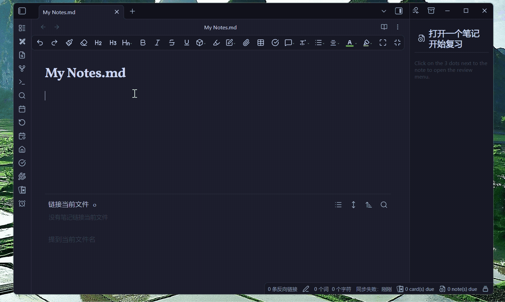

# Bring to Front

> Automatically bring the Obsidian window to the front when a dialog or notification appears

**English** · [简体中文](README.zh.md)

[](https://github.com/rockbenben/bring-obsidian-to-front/releases/latest)
[](LICENSE)
[](https://github.com/rockbenben/365opensource)

## What it does

Obsidian's reminders, sync warnings and plugin pop-ups all appear inside its own window. If you're working in a browser or an editor at the time, they come and go without you ever seeing them — Obsidian has no way to get your attention. This plugin gives it one.

**It works the moment you enable it — no setup, no keywords, nothing to configure.** If you want, you can later filter what triggers it (see [Settings](#settings-all-optional)).

> **Desktop only** (Windows / macOS / Linux). It uses Electron window APIs and does not run on mobile. Requires Obsidian **1.8.7** or newer.



## Installation

### From Obsidian (recommended)

1. Open **Settings → Third-party plugin**.
2. Turn off Restricted mode, then click **Browse**.
3. Search for **Bring to Front**, then **Install** and **Enable**.

Or open the [community plugin page](https://community.obsidian.md/plugins/bring-to-front) directly.

### Manual

1. From the [latest release](https://github.com/rockbenben/bring-obsidian-to-front/releases/latest), download **`main.js`**, **`manifest.json`** and **`styles.css`**.
2. Put all three files into this folder (create it if it doesn't exist):

   ```text
   YourVault/.obsidian/plugins/bring-to-front/
   ```

3. Reload Obsidian, then enable the plugin in **Settings → Third-party plugin**.

## Usage

There's nothing to set up — once enabled, it just works. Worth knowing: when the window already has focus it does nothing, so it never steals focus from itself while you're typing.

### Example: never miss a reminder

A great pairing is with reminder plugins like **Reminder** or **Tasks**, so a reminder never stays hidden while you work in another app:

1. Keep the default settings — **no keywords needed**.
2. Create a task with a due time, for example using the Reminder plugin syntax:

   ```markdown
   - [ ] Submit report (@2026-06-09 14:30)
   ```

3. Switch to another app.
4. When the reminder pops up, Obsidian comes to the front automatically.

Getting pulled forward too often? Use **Keywords** or **Watch for** below to limit it to only the pop-ups you care about.

## Settings (all optional)

Open **Settings → Third-party plugin → Bring to Front**. The defaults work well for most people; change these only if you want to fine-tune.

| Setting            | What it does                                                                                          | Default                  |
| ------------------ | ---------------------------------------------------------------------------------------------------- | ------------------------ |
| Enabled            | Turn the raising off without losing your settings                                                     | On                       |
| Plugin language    | Language of these settings                                                                            | Follow Obsidian          |
| Keywords           | Only trigger when the pop-up text contains one of these comma-separated words (case-insensitive). Empty = any pop-up. | Empty                    |
| Watch for          | What to react to: Dialogs, Notifications, both, or your own selector                                   | Dialogs & notifications  |
| Selector           | Your own CSS selector. Empty = dialogs and notifications. (Shown only when Watch for = Custom selector) | Empty                    |
| Cooldown (seconds) | Shortest wait between two raises, so it doesn't interrupt repeatedly. 0 = no wait.                      | 5                        |
| Quiet hours        | Stay out of the way during a time range you choose. Ranges may span midnight.                           | Off (22:00–08:00)        |
| Debug mode         | Record what was detected in the developer console (Ctrl+Shift+I)                                        | Off                      |

### Quiet hours

Turn this on and pick a start and end time to stop the window from jumping in front of you at night. **Nothing is suppressed except the window raise** — dialogs and notifications still appear in Obsidian exactly as usual, so anything that arrives during quiet hours is waiting for you when you switch back.

Ranges that cross midnight work as you'd expect: `22:00`–`08:00` covers the whole night. The start time counts as inside the range and the end time as outside, so `22:00`–`08:00` and `08:00`–`22:00` divide the day with no overlap and no gap. A range whose start and end are the same time silences nothing, and the settings page says so.

### Filtering examples (optional)

| Goal                                 | Keywords        | Watch for                          |
| ------------------------------------ | --------------- | ---------------------------------- |
| Bring to front on anything (default) | (empty)         | Dialogs & notifications            |
| Only reminder dialogs                | `snooze, done`  | Dialogs                            |
| Only error / sync notifications      | `error, failed` | Notifications                      |
| A specific plugin's pop-up           | (empty)         | Custom selector: `[data-type="my-plugin"]` |

> **Tip:** use a short cooldown (1–30 s) for things you want to see right away, or a longer one (≥ 120 s) if it feels intrusive.

## How it works

Bring to Front watches the Obsidian window for new pop-ups — dialogs and notifications. When one appears while the window is in the background (and matches your optional keywords/scope), it raises the window via Electron's window APIs — restore if minimized, show if hidden, briefly pin on top, then focus. If the window is already focused, it stays out of the way.

## Troubleshooting

| Problem                  | Try this                                                                                  |
| ------------------------ | ----------------------------------------------------------------------------------------- |
| Pops up too often        | Increase **Cooldown**, or add **Keywords** to narrow what triggers it.              |
| Interrupts at night      | Turn on **Quiet hours** and set a range such as 22:00–08:00.                              |
| Doesn't pop up           | Make sure **Enabled** is on and Obsidian is actually in the background; clear **Keywords** and set **Watch for** to "Dialogs & notifications"; confirm the pop-up text matches your keywords. If you set a **Selector**, an unparseable one is flagged in red and ignored — the plugin keeps watching dialogs and notifications instead of going silent. |
| Want to see what happens | Enable **Debug mode**, open the developer console (Ctrl+Shift+I), and watch for `[Bring to Front]` messages. |

## Development

```bash
git clone https://github.com/rockbenben/bring-obsidian-to-front.git
cd bring-obsidian-to-front
npm install
npm run dev    # watch build
npm run lint   # same rules the Obsidian plugin review bot runs
npm run build  # type-check + lint + production build
```

`main.js` is the bundle of `main.ts`; `styles.css` is **not** imported by it — Obsidian loads the file straight from the plugin folder, so it has to be shipped alongside `main.js`. Every rule there is scoped under `.btf-settings`, which `display()` puts on the settings container, so the plugin cannot restyle the rest of Obsidian.

## Contributing

Issues and suggestions are welcome on [GitHub](https://github.com/rockbenben/bring-obsidian-to-front/issues).

## About the 365 Open Source Plan

Project **#005** of the [365 Open Source Plan](https://github.com/rockbenben/365opensource) — one person + AI, 300+ open-source projects in a year. [Submit your idea →](https://365.aishort.top/) · [Discord](https://discord.gg/PZTQfJ4GjX) · [Telegram](https://t.me/aishort_top)
