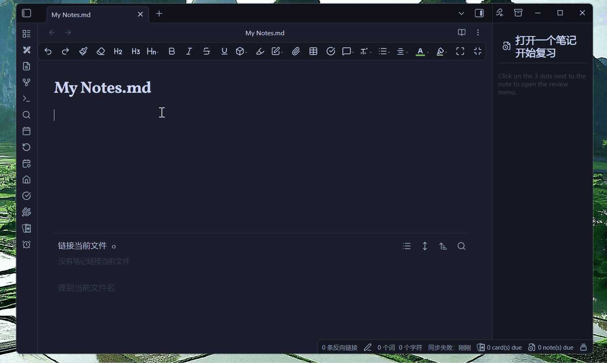

# Bring to Front

> 弹窗或通知出现时，自动把 Obsidian 窗口置顶，别让提醒被埋在后台

[English](README.md) · **简体中文**

[](https://github.com/rockbenben/bring-obsidian-to-front/releases/latest)
[](LICENSE)
[](https://github.com/rockbenben/365opensource)

## 它能做什么

Obsidian 的提醒、同步告警、插件通知全都只出现在它自己的窗口里。你要是正在浏览器或编辑器里忙，这些提示弹出又消失，你根本看不到——Obsidian 没有办法引起你的注意。这个插件给了它一个办法。

**启用即用——无需设置、无需关键词、不用配置任何东西。** 如果愿意，之后也可以过滤只在特定内容上触发(见[设置](#设置全部可选))。

> **仅桌面端**(Windows / macOS / Linux)，依赖 Electron 窗口 API，移动端无法使用。需要 Obsidian **1.8.7** 或更高版本。



## 安装

### 从 Obsidian 安装(推荐)

1. 打开 **设置 → 第三方插件**。
2. 关闭「安全模式」，点击 **浏览**。
3. 搜索 **Bring to Front**，依次点击 **安装**、**启用**。

也可直接打开[社区插件页面](https://community.obsidian.md/plugins/bring-to-front)。

### 手动安装

1. 在[最新版本](https://github.com/rockbenben/bring-obsidian-to-front/releases/latest)中下载 **`main.js`** 和 **`manifest.json`** 两个文件。
2. 把这两个文件放进下面的目录(没有就新建):

   ```text
   YourVault/.obsidian/plugins/bring-to-front/
   ```

3. 重新加载 Obsidian，然后在 **设置 → 第三方插件** 中启用。

## 使用

不需要任何设置——启用后就生效。有一点值得知道：窗口已在前台时它什么都不做，所以不会在你打字时自己抢自己的焦点。

### 示例：不漏掉提醒

最常见的用法是配合 **Reminder**、**Tasks** 等提醒类插件，让提醒在你切到别的程序时也不会被埋没：

1. 保持默认设置——**不用填关键词**。
2. 新建一个带到期时间的任务，例如用 Reminder 插件语法：

   ```markdown
   - [ ] 提交报告 (@2026-06-09 14:30)
   ```

3. 切换到别的程序。
4. 提醒弹出时，Obsidian 会自动跳到前台。

被打扰得太频繁？用下面的 **关键词** 或 **监听范围** 把它限制在你真正关心的弹窗上。

## 设置(全部可选)

打开 **设置 → 第三方插件 → Bring to Front**。默认值对大多数人都合适，只有想微调时才需要改这些。

| 设置          | 作用                                                                       | 默认值       |
| ------------- | -------------------------------------------------------------------------- | ------------ |
| 语言          | 界面语言                                                                   | 自动检测     |
| 关键词        | 仅当弹窗文本包含其中任一词时才触发(逗号分隔，不区分大小写)。留空 = 任意弹窗。 | 空           |
| 监听范围      | 监听什么:弹窗(对话框)、通知(右上角提示)、两者，或自定义 CSS 选择器       | 弹窗和通知   |
| CSS 选择器    | 你自己的选择器(仅当监听范围 = 自定义时显示)                               | 空           |
| 聚焦冷却      | 两次置顶之间的最小间隔秒数，避免反复打扰。0 = 不限制                        | 5 秒         |
| 静默时段      | 在指定时段内不打扰，支持跨午夜                                             | 关闭(22:00–08:00) |
| 调试模式      | 在控制台(Ctrl+Shift+I)输出匹配详情                                        | 关闭         |

### 静默时段

打开后设定起止时间，夜里窗口就不会再突然跳到你面前。**被拦下的只有置顶动作**——弹窗和通知照常出现在 Obsidian 里，静默期间到达的内容会一直等着你，切回窗口就能看到，不会遗漏。

跨午夜的时段按预期工作：`22:00`–`08:00` 覆盖整夜。开始时间算在时段内、结束时间算在时段外，因此 `22:00`–`08:00` 与 `08:00`–`22:00` 恰好把一天分完，不重叠也不留空隙。

### 过滤示例(可选)

| 目标                       | 关键词          | 监听范围                          |
| -------------------------- | --------------- | --------------------------------- |
| 任何弹窗都置顶(默认)     | (留空)          | 弹窗和通知                        |
| 只针对提醒弹窗             | `snooze, done`  | 弹窗                              |
| 只针对错误 / 同步提示      | `error, failed` | 通知                              |
| 某个插件的弹窗             | (留空)          | 自定义:`[data-type="my-plugin"]` |

> **提示：** 想立刻看到的用短冷却(1–30 秒)；觉得打扰就用长冷却(≥ 120 秒)。

## 工作原理

Bring to Front 监听 Obsidian 窗口里新出现的弹窗和通知。当窗口在后台、又出现匹配(可选的关键词/范围)的弹窗时，它通过 Electron 窗口 API 把窗口拉前——最小化则恢复、隐藏则显示、短暂置顶、再聚焦。窗口已在前台时不打扰。

## 故障排除

| 问题             | 试试这样                                                                       |
| ---------------- | ------------------------------------------------------------------------------ |
| 置顶太频繁       | 调大 **聚焦冷却**，或填 **关键词** 缩小触发范围。                               |
| 夜里被打扰       | 打开 **静默时段**，设成 22:00–08:00 之类的范围。                                |
| 不置顶           | 确认 Obsidian 确实在后台；清空 **关键词** 并把 **监听范围** 设为「弹窗和通知」；确认弹窗文本含你的关键词。 |
| 想看发生了什么   | 开 **调试模式**，打开控制台(Ctrl+Shift+I)，观察 `[Bring to Front]` 日志。      |

## 开发

```bash
git clone https://github.com/rockbenben/bring-obsidian-to-front.git
cd bring-obsidian-to-front
npm install
npm run dev    # 监听构建
npm run lint   # 官方插件审核 bot 使用的同一套规则
npm run build  # 类型检查 + lint + 生产构建
```

## 参与贡献

欢迎在 [GitHub](https://github.com/rockbenben/bring-obsidian-to-front/issues) 提交问题与建议。

## 关于 365 开源计划

[365 开源计划](https://github.com/rockbenben/365opensource) 的第 **#005** 个项目——一个人 + AI，一年 300+ 个开源项目。[提交你的需求 →](https://365.aishort.top/) · [Discord](https://discord.gg/PZTQfJ4GjX) · [Telegram](https://t.me/aishort_top)
